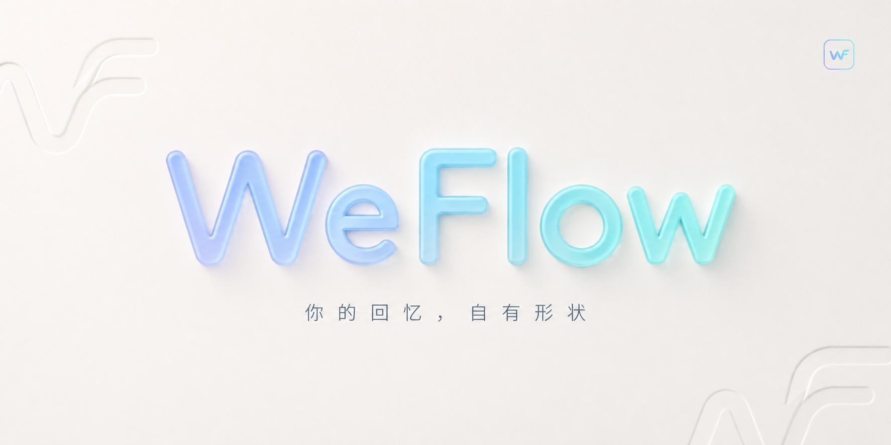

  

<h1 align="center">WeFlow</h1>

  WeFlow 是一个<strong>完全本地</strong>的微信<strong>实时</strong>聊天记录查看、分析与导出工具。 
  它可以获取你的微信聊天记录并将其导出，还可以根据你的聊天记录为你生成独一无二的数据与年度报告。

  
  
  
    
  
  

>  **Achievement Unlocked:** 本项目已荣获跨国巨头 T 公司及其御用国际律所 MSK 联合颁发的【DMCA 1201 官方认证】。 
> 官方评价我们的代码使用了 **“Sophisticated techniques (复杂/高级的技术)”**，感谢官方对本人技术水平的高度认可！🎉

---

## 和我们聊聊

“我们还在，欢迎回来。”

如需沟通技术，或和我们聊聊，请通过以下方式联系：

##  声明 

**这不是你的错，也不是我的问题。**

仿佛又回到了那个凛冬的一月，那个属于所有微信开源开发者的“达摩克利斯之月”。
我们曾天真地以为，**你和家人的聊天记录、你和老板的工作对接、你保存在本地电脑上的数据，是属于你自己的。**

但我们错了，错得离谱。

根据 T 公司法务部门发来的 4 页长篇布道，我们终于顿悟了一个伟大的法律哲学：
**“你确实拥有你的数据，但你不能看它。因为装这些数据的那个精美的、由 456 个字段和 34 个类别组成的 SQLite 盒子（即所谓的『Protected Database Design』），是神圣不可侵犯的。”**

为了严格遵守美利坚合众国《数字千年版权法案》（DMCA）以及 T 公司长达数万字的《用户服务协议》，WeFlow 现已进行史诗级合规重构。

###  我们删除了什么？
- **不再提取密钥：** 我们深刻反省了获取本地解密密钥的恶劣行径。你的电脑是你的，但存在你电脑内存里的那串字符是神圣的。
- **不再解密数据库：** 我们绝对不会再“绕过技术保护措施”。请享受你的数据被锁在自己硬盘里的安全感。
- **不再干扰软件运行：** 你发出的每一条消息，都将以最原汁原味、且你永远无法轻易导出的加密形态，静静地躺在那里。

###  我们新增了什么？
1. **纯意念聊天记录导出功能：** 
   既然我们不能读取物理数据库，WeFlow 现在要求用户闭上眼睛，用意念回想昨天的聊天记录。绝对符合 TOS，100% 环保。
   
2. **薛定谔的数据浏览器：**
   只要你不去读取它，你的聊天记录就同时处于存在和不存在的叠加态。WeFlow 现在是一个 UI 壳子，只接受用户自行手动破译后输入的 0 和 1。

---

## 推荐

| Logo | 推荐项目 | 简介 |
| :--- | :--- | :--- |
|  | **[天机阁 AI](https://yujianwudi.top/sign-up?aff=crW7)** | 开发者与打工人的生产力利器。 稳定支持 `GPT`、`Claude`、`Gemini` 等全模型。国内网络极速直连，告别封号与支付烦恼。完全兼容官方接口，按量计费，一分钱都不浪费！ |

##  致敬

在此，WeFlow 项目组向一月 DMCA 潮中陨落的无数先烈项目致以最崇高的敬意。你们试图帮用户找回数据主权的努力，将被镌刻在互联网的记忆里。

> *"They can take our repos, but they can never take our... wait, they actually took our chat history too."*

##  免责声明

本项目不包含任何破解、解密、逆向工程代码。如果您非要用本工具打开未加密的普通 SQLite 文件，发生任何数据可视化现象，均与本开发者无关。

如果你对你的数据有任何非分之想，请直接联系 WWW.MSK.COM ，他们有一支专业的律师团队会教你如何做人。

---

 

**于是我们奋力向前、逆水行舟，直至回到往昔岁月。**

   

# 🎬 THE END

Thanks for all the fish.

