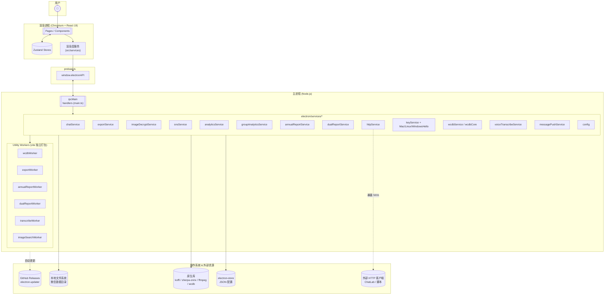
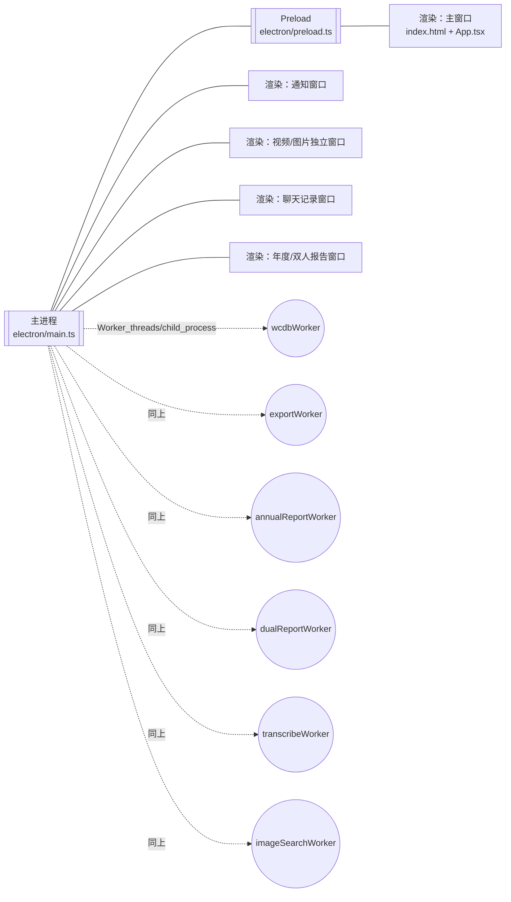
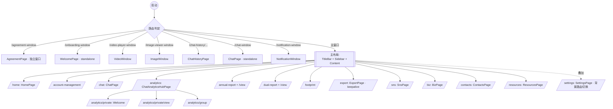
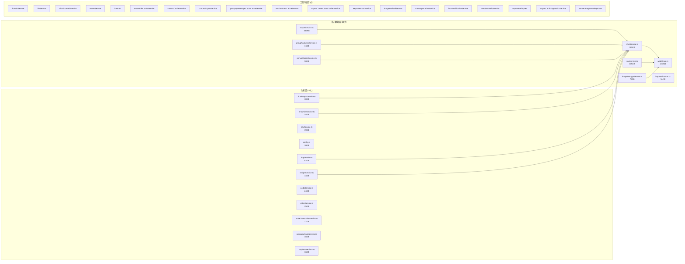
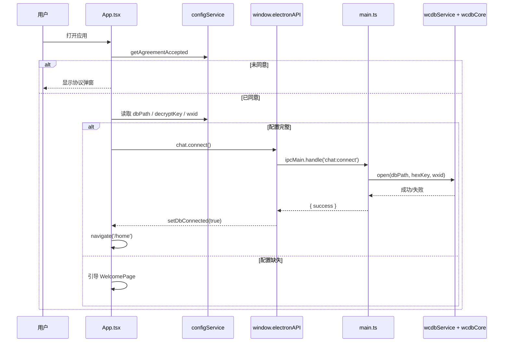
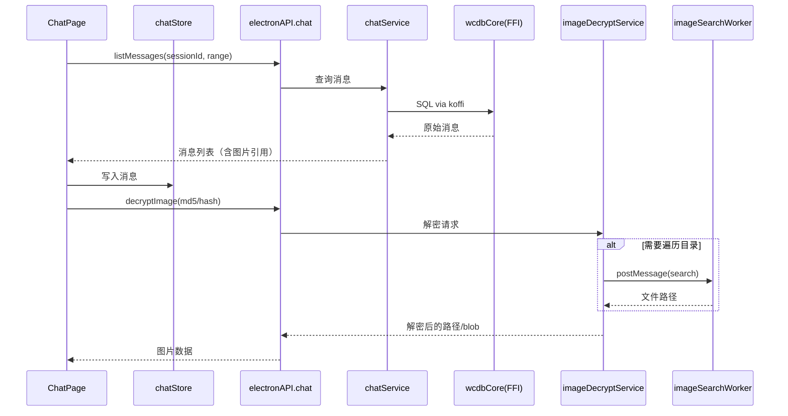
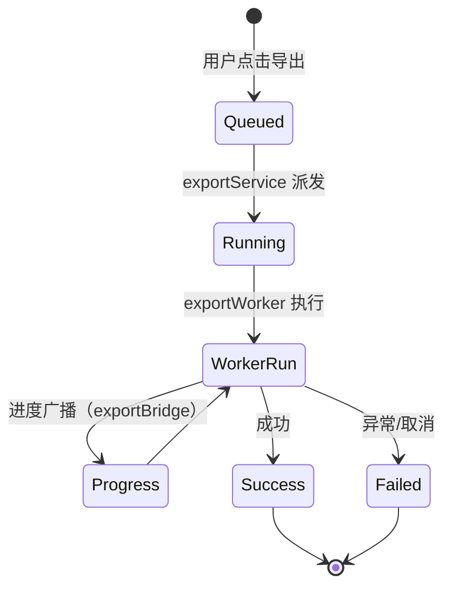

# WeFlow 项目蓝图与架构文档

> 版本：对应 `package.json` v4.3.0 · 生成时间：2026-04-17  
> 适用于开发者、新成员上手、Agent（CodeBuddy 等）自动化协作

---

## 1. 项目定位

**WeFlow** 是一个**完全本地**的微信 4.0+ 聊天记录查看、分析与导出的桌面应用。

| 维度 | 说明 |
|------|------|
| 产品形态 | Electron 桌面应用（Windows / macOS / Linux） |
| 核心诉求 | 实时查看 & 解密本地微信数据库、生成聊天分析 / 年度报告 / 双人报告、导出多格式、朋友圈解密 |
| 数据边界 | 全部本地运行，无云端上传；可选开放本地 HTTP API（端口 5031） |
| 许可 | 见 `LICENSE` |
| 版本策略 | electron-updater + GitHub Releases，支持自动更新与差分包 |

### 1.1 关键功能矩阵

| 模块 | 能力概述 | 主要代码落点 |
|------|---------|-------------|
| 实时聊天查看 | 消息列表、撤回防护、实时刷新 | [ChatPage.tsx](src/pages/ChatPage.tsx) + [chatService.ts](electron/services/chatService.ts) |
| 图片/视频/实况解密 | XOR / AES + ffmpeg 转码 | [imageDecryptService.ts](electron/services/imageDecryptService.ts), [videoService.ts](electron/services/videoService.ts) |
| 私聊/群聊分析 | 统计消息、时段、画像 | [analyticsService.ts](electron/services/analyticsService.ts), [groupAnalyticsService.ts](electron/services/groupAnalyticsService.ts) |
| 年度 / 双人报告 | 跨年数据生成、可视化 | [annualReportService.ts](electron/services/annualReportService.ts), [dualReportService.ts](electron/services/dualReportService.ts) + 对应 Worker |
| 导出 | JSON / HTML / TXT / Excel / CSV / ChatLab | [exportService.ts](electron/services/exportService.ts) + [exportWorker.ts](electron/exportWorker.ts) |
| 朋友圈 | 图片/视频/实况解密、时间突破 | [snsService.ts](electron/services/snsService.ts) + [SnsPage.tsx](src/pages/SnsPage.tsx) |
| HTTP API | 本地消息 API 服务 | [httpService.ts](electron/services/httpService.ts) + [docs/HTTP-API.md](docs/HTTP-API.md) |
| 语音转写 | sherpa-onnx ASR + silk-wasm | [voiceTranscribeService.ts](electron/services/voiceTranscribeService.ts) + [transcribeWorker.ts](electron/transcribeWorker.ts) |
| 通知与防撤回 | 桌面弹窗、黑白名单 | [messagePushService.ts](electron/services/messagePushService.ts), [notificationWindow.ts](electron/windows/notificationWindow.ts) |
| 应用锁 | Windows Hello / 系统凭据 | [windowsHelloService.ts](electron/services/windowsHelloService.ts) + [LockScreen.tsx](src/components/LockScreen.tsx) |

---

## 2. 技术栈总览

### 2.1 运行时 & 构建

| 层 | 技术 | 说明 |
|----|------|------|
| Shell | Electron 41 | 主进程 + 渲染进程分离 |
| 渲染进程 | React 19 + TypeScript 6 | 使用 `react-router-dom@7` 路由 |
| 构建 | Vite 7 + `vite-plugin-electron` + `vite-plugin-electron-renderer` | 一次构建产出主/渲染/Worker |
| 样式 | SCSS（`sass`） + 组件局部样式 | 深浅色 + 主题色切换（`data-theme` / `data-mode`） |
| 打包 | electron-builder 26 | Win `.exe`(NSIS)、macOS `.dmg/.zip`、Linux `AppImage/tar.gz` |
| 自动更新 | electron-updater + GitHub provider | 差分包关闭，支持强制更新 |

### 2.2 核心依赖

| 类别 | 库 | 用途 |
|------|----|------|
| 状态管理 | `zustand` | 轻量全局 store，见 `src/stores/` |
| UI 图标 | `lucide-react` | 图标系统 |
| 图表 | `echarts` + `echarts-for-react` | 分析与报告可视化 |
| 长列表 | `react-virtuoso` | 聊天消息虚拟滚动 |
| Markdown | `react-markdown` + `remark-gfm` | 报告与富文本 |
| 数据库 | `wcdb` 原生 + `koffi` FFI | 微信 SQLite/WCDB 加密数据库读取 |
| 多媒体 | `ffmpeg-static`、`silk-wasm`、`sherpa-onnx-node` | 视频解码、silk 语音、ASR |
| 中文分词 | `jieba-wasm` | 词云与分析 |
| 配置 | `electron-store` | JSON 持久化 |
| 导出 | `exceljs`、`jszip`、`html2canvas` | 多格式产物 |
| 辅助 | `fzstd`、`wechat-emojis`、`sudo-prompt` | zstd 解压、表情、提权 |

---

## 3. 目录蓝图

```
WeFlow/
├── electron/                         # 主进程与 Worker（Node.js 环境）
│   ├── main.ts                       # 主进程入口（≈122KB，IPC 汇聚点）
│   ├── preload.ts                    # 预加载脚本，暴露 window.electronAPI
│   ├── preload-env.ts                # 环境预加载（启动前）
│   ├── annualReportWorker.ts         # 年度报告工作线程
│   ├── dualReportWorker.ts           # 双人报告工作线程
│   ├── exportWorker.ts               # 导出工作线程
│   ├── imageSearchWorker.ts          # 图像检索/遍历工作线程
│   ├── transcribeWorker.ts           # 语音转写工作线程
│   ├── wcdbWorker.ts                 # WCDB 读取工作线程
│   ├── services/                     # 业务服务（按域拆分）
│   ├── windows/notificationWindow.ts # 独立通知窗口
│   ├── utils/LRUCache.ts             # 主进程工具
│   ├── assets/wasm/                  # wasm 资源（jieba、silk 等）
│   └── types/                        # 原生模块类型声明
│
├── src/                              # 渲染进程（React）
│   ├── main.tsx / App.tsx / App.scss # 入口与根路由
│   ├── pages/                        # 页面级组件（大文件集中地）
│   ├── components/                   # 通用/业务组件
│   │   ├── Export/                   # 导出子组件
│   │   └── Sns/                      # 朋友圈子组件
│   ├── services/                     # 渲染层服务（通过 IPC 调用主进程）
│   ├── stores/                       # Zustand 全局状态
│   ├── styles/                       # 全局样式与主题
│   ├── types/                        # 渲染层类型
│   └── utils/                        # 工具函数
│
├── docs/                             # 项目文档（HTTP-API、架构文档等）
├── resources/                        # 平台资源：icons / runtime / wcdb / key / installer
├── public/                           # 前端静态资源 + splash
├── .github/workflows/                # CI：release、nightly、security-scan 等
├── AGENTS.md                         # Agent 协作规则
├── README.md                         # 用户说明
├── package.json                      # 依赖 + electron-builder 配置
├── vite.config.ts                    # 构建管线（1 主 + 7 Worker + preload）
├── tsconfig.json / tsconfig.node.json
├── installer.nsh                     # NSIS 安装脚本
└── .gitleaks.toml                    # 密钥扫描配置
```

---

## 4. 架构总览

### 4.1 高层架构图



### 4.2 进程与线程模型



> 关键设计：**CPU 密集或长耗任务全部外包到独立 Worker**，通过 `vite.config.ts` 的多 entry 独立打包。`inlineDynamicImports: true` 保证 worker 单文件产物可 `new Worker(path)` 直接加载。

### 4.3 通信契约（IPC 命名空间）

`electron/main.ts` 中 `ipcMain.handle` / `ipcMain.on` 采用 **前缀:动作** 命名空间，统一走 [preload.ts](electron/preload.ts) 暴露的 `window.electronAPI.<ns>.<method>`：

| 命名空间 | 典型通道 | 所属服务 |
|---------|---------|---------|
| `config:*` | `get` / `set` / `clear` | `config.ts` |
| `dialog:*` | `openFile` / `openDirectory` / `saveFile` | Electron `dialog` |
| `shell:*` | `openPath` / `openExternal` | Electron `shell` |
| `app:*` | `getVersion` / `checkForUpdates` / `downloadAndInstall` / `ignoreUpdate` / `getLaunchAtStartupStatus` | 主进程 + updater |
| `window:*` | `minimize` / `maximize` / `close` / `isMaximized` / `openVideoPlayerWindow` / `openChatHistoryWindow` / `openSessionChatWindow` / `respondCloseConfirm` / `setTitleBarOverlay` | 主窗口管理 |
| `log:*` / `diagnostics:*` | 日志读取、导出卡片诊断 | 日志系统 |
| `cloud:*` | `init` / `recordPage` / `getLogs` | `cloudControlService` |
| `insight:*` | `testConnection` / `getTodayStats` / `triggerTest` / `generateFootprintInsight` | `insightService` |
| `video:*` | `getVideoInfo` / `parseVideoMd5` | `videoService` |
| `dbpath:*` | `autoDetect` / `scanWxids` / `scanWxidCandidates` / `getDefault` | `dbPathService` |
| `wcdb:*` | `testConnection` / `open` / `close` | `wcdbService` |
| `chat:*` | 会话、消息、联系人等（见 `preload.ts`） | `chatService` |
| `export:*` | 导出任务、进度、取消 | `exportService` |
| `sns:*` | 朋友圈列表、解密 | `snsService` |
| `analytics:*` / `group-analytics:*` | 统计查询 | 对应 Service |
| `annual-report:*` / `dual-report:*` | 报告生成 | 对应 Service |
| `voice:*` | 语音转写 | `voiceTranscribeService` |
| `auth:*` | 应用锁状态 | `keyService*` / `windowsHelloService` |
| `notification:*` | 新消息通知与跳转 | `messagePushService` + `notificationWindow` |

> 上述仅为骨架，完整 IPC 契约以 [preload.ts](electron/preload.ts) 为唯一来源（≈28KB，包含完整白名单与类型）。

---

## 5. 渲染进程结构

### 5.1 路由蓝图

基于 [App.tsx](src/App.tsx) 的实际路由：



**亮点**：
- **ExportPage 采用 keep-alive 模式**：用 `export-keepalive-page` DOM 容器常驻，仅切换 `active/hidden` class，避免长任务重置。
- **Settings 路由叠加**：通过 `location.state.backgroundLocation` 实现在任意页面上浮设置面板。
- **多独立窗口**：视频、图片、通知、聊天记录、会话聊天、年度/双人报告均有独立 `BrowserWindow`。

### 5.2 Zustand Stores

| Store | 文件 | 职责 |
|-------|------|------|
| `useAppStore` | `src/stores/appStore.ts` | 数据库连接状态、更新信息、锁屏 |
| `useThemeStore` | `src/stores/themeStore.ts` | 主题 ID / 模式（light/dark/system） |
| `useChatStore` | `src/stores/chatStore.ts` | 当前会话、选中消息 |
| `useAnalyticsStore` | `src/stores/analyticsStore.ts` | 分析页参数与缓存 |
| `useImageStore` | `src/stores/imageStore.ts` | 图片解密结果缓存 |
| `useBatchImageDecryptStore` | `src/stores/batchImageDecryptStore.ts` | 全局批量解密进度 |
| `useBatchTranscribeStore` | `src/stores/batchTranscribeStore.ts` | 全局批量转写进度 |
| `useContactTypeCountsStore` | `src/stores/contactTypeCountsStore.ts` | 联系人分类计数缓存 |

### 5.3 渲染层服务

| 文件 | 角色 |
|------|------|
| `src/services/ipc.ts` | IPC 桥接基础（与 preload 对齐） |
| `src/services/config.ts` | 配置封装（73KB，大量常量与 setter/getter） |
| `src/services/exportBridge.ts` | 导出事件桥（主→渲染进度广播） |
| `src/services/cloudControl.ts` | 云控 / 统计上报（仅在用户同意后启用） |
| `src/services/backgroundTaskMonitor.ts` | 后台任务监测（解密、转写、导出） |

---

## 6. 主进程服务层（`electron/services/`）

### 6.1 服务地图（按规模分层）



### 6.2 关键服务职责

| 服务 | 核心职责 | 特别说明 |
|------|---------|---------|
| `chatService` | 会话列表、消息读取、媒体定位、实时刷新 | 超大文件，必须用 `codebase_search` / `view_code_item` 定位后再改 |
| `wcdbCore` / `wcdbService` | 基于 `koffi` FFI 调用 WCDB 原生库，解密读取微信 SQLite | 跨平台原生库放在 `resources/wcdb/<platform>/` |
| `keyService*` | 获取微信解密密钥（Win/Mac/Linux） | Mac 51KB：涉及内存扫描；Linux 独立实现；Win 通过 `windowsHelloService` 辅助 |
| `imageDecryptService` | XOR / AES 解密图片、实况图片 | LRU 缓存 + 批量调度（配合 `batchImageDecryptStore`） |
| `videoService` | 视频 md5 解析、ffmpeg 转码、生成封面 | 依赖 `ffmpeg-static` + `asarUnpack` |
| `voiceTranscribeService` | silk→wav→sherpa-onnx ASR | 通过 `transcribeWorker` 异步执行 |
| `snsService` | 朋友圈解密、导出、时间限制突破 | 单独的 `Sns/` 组件族对应 |
| `analyticsService` / `groupAnalyticsService` | 私聊/群聊统计分析、排行、时段分布 | 依赖 `jieba-wasm` 分词 |
| `annualReportService` / `dualReportService` | 年度/双人报告生成 | 将重算任务派给对应 Worker |
| `exportService` + `exportWorker` | 多格式导出，分任务并发 + 进度广播 | HTML 导出样式来自 [exportHtml.css](electron/services/exportHtml.css) |
| `httpService` | 本地 HTTP API 服务（默认 5031） | 详见 [docs/HTTP-API.md](docs/HTTP-API.md) |
| `messagePushService` | 新消息监听 + 通知窗口推送 | 黑白名单、防撤回 |
| `insightService` | 「我的足迹」洞察 / AI 辅助洞察 | 支持 Footprint 生成 |
| `config` | 使用 `electron-store` 的 JSON 配置中台 | 多 wxid 配置、密钥、主题、协议同意等 |
| `cloudControlService` | 开关/页面统计（用户同意后） | 完全本地化的云控模型 |

---

## 7. 核心数据流

### 7.1 启动 & 连接数据库流程



### 7.2 聊天消息读取与图片解密



### 7.3 导出任务生命周期



**进度通道**：`exportService` → 主进程事件 → `exportBridge.ts` → 渲染层订阅者（`ExportPage`）。

---

## 8. 构建与发布

### 8.1 Vite 多入口

[vite.config.ts](vite.config.ts) 声明 **8 个 entry**：

| Entry | 产物 | 说明 |
|-------|------|------|
| `electron/main.ts` | `dist-electron/main.js` | 主进程 |
| `electron/preload.ts` | `dist-electron/preload.js` | 预加载 |
| `electron/annualReportWorker.ts` | `dist-electron/annualReportWorker.js` | 年度报告 worker |
| `electron/dualReportWorker.ts` | `dist-electron/dualReportWorker.js` | 双人报告 worker |
| `electron/imageSearchWorker.ts` | `dist-electron/imageSearchWorker.js` | 图像搜索 worker |
| `electron/wcdbWorker.ts` | `dist-electron/wcdbWorker.js` | WCDB worker |
| `electron/transcribeWorker.ts` | `dist-electron/transcribeWorker.js` | 语音转写 worker |
| `electron/exportWorker.ts` | `dist-electron/exportWorker.js` | 导出 worker |

- `react(), renderer()` 插件处理渲染进程；`inlineDynamicImports: true` 确保 worker 单文件。
- `external`：`koffi` / `better-sqlite3` / `sherpa-onnx-node` / `exceljs` / `ffmpeg-static` 不打包进 bundle，asar 外存放。

### 8.2 打包策略（electron-builder）

| 平台 | Target | 关键配置 |
|------|--------|---------|
| Windows | `nsis` | `installer.nsh`、多语言安装器、VC++ 运行库随包 |
| macOS | `dmg` + `zip` | `hardenedRuntime: false`、`entitlements.mac.plist` |
| Linux | `AppImage` + `tar.gz` | 附带 `resources/linux/install.sh` |
| `asarUnpack` | `silk-wasm` / `sherpa-onnx-*` / `ffmpeg-static` | 原生/二进制模块不能进 asar |
| `extraResources` | `resources/**` + `public/icon.*` + `electron/assets/wasm/` | 运行时资源 |
| `publish` | GitHub `Jasonzhu1207/WeFlow` | 配合 `electron-updater` |

### 8.3 CI 流水线（`.github/workflows/`）

| 文件 | 作用 |
|------|------|
| `release.yml` | 发布打包 |
| `preview-nightly-main.yml` | Nightly 构建 |
| `dev-daily-fixed.yml` | Dev 日常 |
| `security-scan.yml` | 安全扫描（含 gitleaks） |
| `anti-spam.yml` | Issue 反垃圾 |
| `issue-auto-assign.yml` | Issue 自动分派 |

---

## 9. 安全与合规设计

1. **数据本地化**：全部解密、分析、导出均在本地执行，不上传任何聊天内容（协议与隐私弹窗双重同意）。
2. **密钥保护**：
   - 微信 key 通过平台特定 `keyService*` 动态获取，不落盘；
   - 应用锁可选 Windows Hello / 系统凭据；
   - `.gitleaks.toml` 扫描源码防止密钥入库。
3. **参数化查询**：所有 SQLite 查询通过 WCDB 参数化接口，避免拼接。
4. **更新通道**：仅从 GitHub Releases 拉取，支持强制更新（`minimumVersion`）。
5. **云控与统计**：`cloudControlService` 完全可选，用户可拒绝；默认不采集任何聊天内容。
6. **IPC 白名单**：`preload.ts` 通过 `contextBridge` 仅暴露有限 API，渲染层无法直接访问 Node。

---

## 10. 性能关键点

| 热点 | 设计 |
|------|------|
| 消息列表（聊天动辄百万级） | `react-virtuoso` 虚拟滚动 + `chatService` 分页 + `LRUCache` |
| 图片解密批量（几千张） | `imageDecryptService` + `imageSearchWorker` + 全局进度 store |
| 年度/双人报告（跨年聚合） | 独立 Worker + 分块流式 + 缓存（`groupMyMessageCountCacheService`、`sessionStatsCacheService` 等） |
| 导出大体量 HTML/Excel | `exportWorker` + `jszip` 流式写入 + 进度广播 |
| 主题切换 & 样式 | CSS 变量 + `data-theme` / `data-mode` 根属性切换，无重渲染 |
| 启动速度 | `splash.html` 早期显示 + 主题预读 + DB 异步连接 |

---

## 11. 扩展点（二开指南）

| 场景 | 落点 |
|------|------|
| 新增页面 | `src/pages/` 新建 `XxxPage.tsx` + `.scss`，在 [App.tsx](src/App.tsx) 路由和 [Sidebar.tsx](src/components/Sidebar.tsx) 菜单登记 |
| 新增主进程能力 | `electron/services/` 新建 service，在 `main.ts` 添加 `ipcMain.handle('ns:action', ...)`，在 [preload.ts](electron/preload.ts) 暴露 → 渲染层新增对应 `src/services/` 或直接 `window.electronAPI.ns.action()` 调用 |
| 新增 Worker | `electron/xxxWorker.ts` 建立，在 [vite.config.ts](vite.config.ts) 添加 entry |
| 新增导出格式 | 扩展 `exportService` + `exportWorker`，UI 在 `src/components/Export/` 与 `ExportPage.tsx` 挂接 |
| 新增 HTTP API | `httpService.ts` 注册路由，同步更新 [docs/HTTP-API.md](docs/HTTP-API.md) |
| 新增主题 | `src/stores/themeStore.ts` 的 themes 列表 + `src/styles/` 主题 SCSS |
| 新语言支持 | 当前未接入 i18n，需要新增语言时优先引入 `react-i18next`（评估风险） |

---

## 12. 已知风险与技术债

| 风险 | 说明 | 缓解建议 |
|------|------|---------|
| 超大文件 | `ChatPage.tsx` 397KB、`ExportPage.tsx` 402KB、`chatService.ts` 389KB、`exportService.ts` 343KB、`SettingsPage.tsx` 174KB | 新增内容尽量独立成文件；只在必须时才对这些文件进行精细化 diff，禁止盲目整读 |
| 原生模块兼容 | `koffi`、`sherpa-onnx-node`、`wcdb` 随平台/Electron 版本变化 | 升级前先 `npm run rebuild` 并跑三端冒烟 |
| 配置 migrate | `electron-store` schema 无正式迁移框架 | 新字段默认可 Optional；破坏性变更需加版本号判定 |
| 单一 `preload.ts` | 28KB，IPC 全部集中 | 保持字段分组；考虑按域拆分 preload 模块（需评估 `contextBridge` 成本） |
| 无自动化测试 | 缺少单元/集成测试 | 新功能按 AGENTS.md "Level 2 TDD" 策略补齐关键分支 |

---

## 13. 快速上手路径（推荐）

1. 通读 [README.md](README.md) + 本架构文档
2. 阅读 [AGENTS.md](AGENTS.md) 了解协作与门禁
3. 顺序浏览：[App.tsx](src/App.tsx) → [Sidebar.tsx](src/components/Sidebar.tsx) → [preload.ts](electron/preload.ts) → [main.ts](electron/main.ts)（搜索 `ipcMain.handle`）
4. 按域选择 Service 细读：聊天链路入口从 `chat:connect` / `chat:listSessions` 反查 [chatService.ts](electron/services/chatService.ts)
5. 运行 `npm install && npm run dev` 启动联调；`npm run typecheck` 验证

---

## 14. 参考文档

- [README.md](README.md)
- [docs/HTTP-API.md](docs/HTTP-API.md)
- [AGENTS.md](AGENTS.md)
- [vite.config.ts](vite.config.ts)
- [package.json](package.json)

